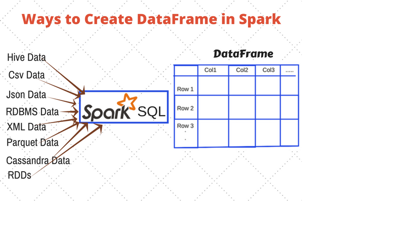

Algoritmos y Estructura de Datos
********************************

# Trabajo Final

### Equipo de Trabajo

* Raúl Casanova
* Diego Bazán

### Introducción

Pandas es una librería utilizada para la manipulación y análisis de datos, en el lenguaje de programación Phyton. Actualmente, en el lenguaje C++, son pocas las librerías que contengan las mismas funcionalidades que la ya expuesta anteriormente. Por ello, en el presente proyecto se replicarán las principales características de esta librería, como por ejemplo, la inserción y eliminación de columnas de datos, o la aplicación de filtros para la búsqueda de datos. La motivación que nos llevó a eleborar este trabajo, es ser capaces de resolver problemas futuros relacionados con la programación, con el uso eficiente de estructuras de datos. Todo esto con la finalidad que personas, las cuales prefieren el uso de C++ como lenguaje de programación tengan acceso a esta biblioteca y sus cualidades.

### Objetivos

_Objetivo general: Responder al problema y le da solución_
_Objetivos especificos: analizar, diseñar, describir y solución_

todos los objetivos deben de tener un solo verbo, y estos deben de tener precedencia (taxonomía de bloom)

### Mapa Conceptual

_Definir: DataFrame, Arboles binarios_

### Diagrama de clases (alto nivel)

data frame, filas, columnas, index

### Cronograma de Trabajo
_Referente a los milestone_
