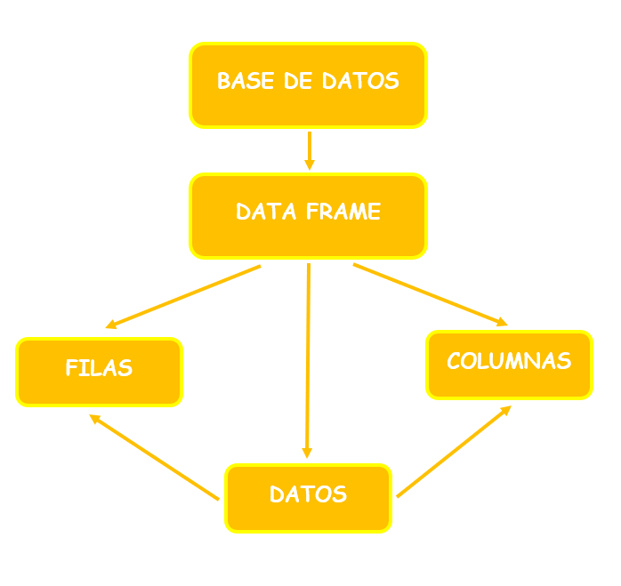
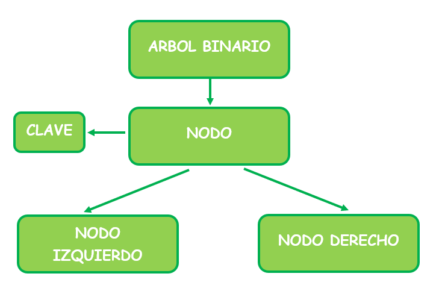
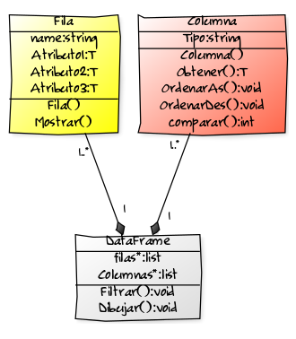

Algoritmos y Estructura de Datos
********************************

# Trabajo Final

## Equipo de Trabajo

* Raúl Casanova
* Diego Bazán

## Introducción

Pandas es una librería utilizada para la manipulación y análisis de datos, en el lenguaje de programación Phyton. Actualmente, en el lenguaje C++, son pocas las librerías que contengan las mismas funcionalidades que la ya expuesta anteriormente. Por ello, en el presente proyecto se replicarán las principales características de esta librería, como por ejemplo, la inserción y eliminación de columnas de datos, o la aplicación de filtros para la búsqueda de datos. La motivación que nos llevó a eleborar este trabajo, es ser capaces de resolver problemas futuros relacionados con la programación, con el uso eficiente de estructuras de datos. Todo esto con la finalidad que personas, las cuales prefieren el uso de C++ como lenguaje de programación tengan acceso a esta biblioteca y sus cualidades.

## Objetivos

* Objetivo General:
   * Resolver el problema implementando una librería en C++ que sea semejante en funcionalidad a la librería Pandas de Python para manejar datos, además de utilizar en ella estructuras de datos y métodos de ordenamiento y búsqueda.

* Objetivos especificos: 
   * Crear una librería en la cual se puedan importar y exportar datos, así como también a través de un dataframe se puedan visualizar, buscar y filtrar dichos datos.
   * Evaluar los distintos tipos algoritmos de ordenamiento y determinar el más eficiente para los requerimientos del proyecto.
   * Aplicar los conocimientos aprendidos en clase para poder resolver el problema de la manera más óptima.

## Marco Conceptual
* Definición de Data Frame:
DataFrame es una estructura de datos tabular bidimensional, potencialmente heterogénea, con ejes etiquetados (filas y columnas). Un dataframe es una estructura de datos bidimensional, es decir, los datos se alinean de forma tabular en filas y columnas. El dataFrame consta de tres componentes principales: los datos, las filas y las columnas.

* Definición de Arboles Binarios:
Un árbol binario es una estructura de datos en la cual cada nodo puede tener un hijo izquierdo y un hijo derecho. No pueden tener más de dos hijos (de ahí el nombre "binario"). Si algún hijo tiene como referencia a null, es decir que no almacena ningún dato, entonces este es llamado un nodo externo. En el caso contrario el hijo es llamado un nodo interno.

## Diagrama de clases (alto nivel)

## Cronograma de Trabajo

El trabajo está dividido en 3 hitos, para los cuales habrá tareas por cumplir para cada uno de los integrantes del equipo de trabajo.
Dichas tareas son las siguientes:

1. Hito 1

    * Realizar Informe (Fecha de entrega: 06/06/19 - Tareas Totales: 6)
    
        * Diego Bazán se encargará de:
          *  Realizar Introducción
          *  Realizar Objetivos Específicos
          *  Realizar Mapa Conceptual  
          
        *  Raúl Casanova se encargará de:
            *  Realizar Objetivo Generale
            *  Realizar Diagrama de clases
            *  Realizar Cronograma de Trabajo
            
1. Hito 2

    * Implementar (Fecha de entrega: 13/06/19 - Tareas Totales: 5)
    
        * Diego Bazán se encargará de:
            * Prototipar: Diseño UI e interacción
            * Diagrama de clases de segundo nivel
            
        * Raúl Casanova se encargará de:
            * Definir TDA y las estructuras a usar
            * Diseñar Componentes
            
        * Ambos se encargarán de:
            * Implementar las clases del hito anterior (la mitad para cada uno)
    
1. Hito 3

    * Finalizar proyecto (Fecha de entrega: 25/06/19 - Tarea Totales: 4)
    
        * Raúl Casanova se encargará de:
            * Diseñar los archivos a utilizar
            * Implemetar componentes de diseño
            
        * Diego Bazán se encargará de:
            * Implementar la persisntencia del software
            * El diseño general del software
    
